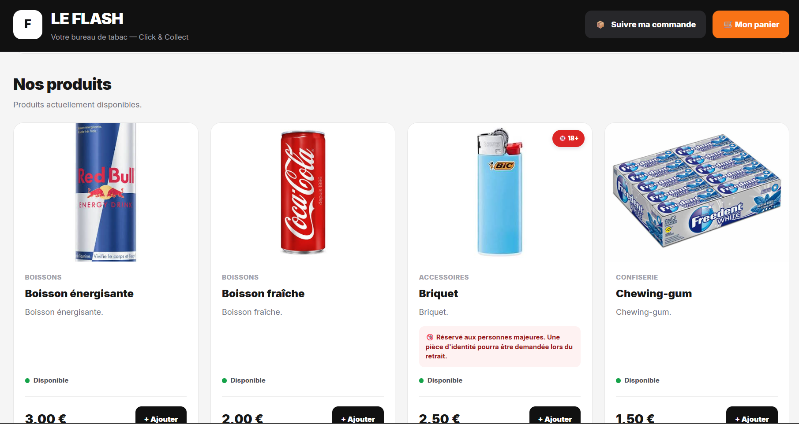
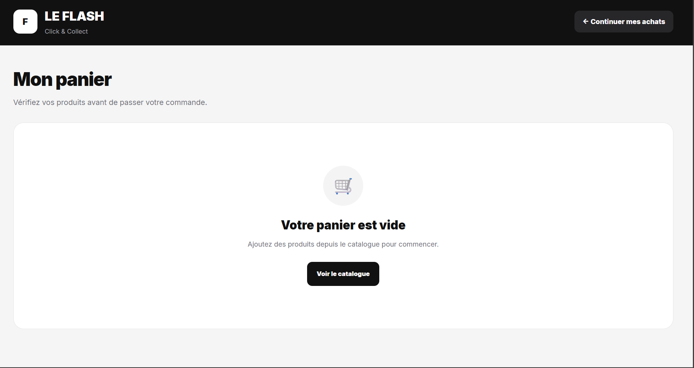
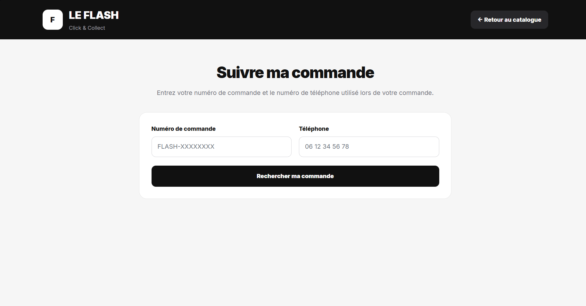
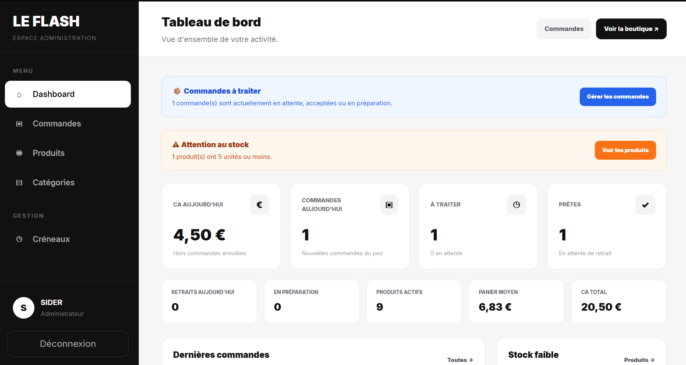

# ⚡ Le Flash — Click & Collect

Application web de **Click & Collect** développée avec Laravel pour permettre aux clients d'un commerce de consulter les produits disponibles, préparer leur panier, choisir un créneau de retrait et suivre leur commande.

Le projet comprend également un **back-office administrateur complet** permettant de gérer les commandes, les produits, les catégories, les stocks et les créneaux de retrait.

---

## 📸 Aperçu

> Des captures d'écran de l'application seront ajoutées ici.

### Boutique



### Panier



### Finalisation de commande



### Dashboard administrateur



---

## 🚀 Fonctionnalités

### 👤 Côté client

- Consultation du catalogue
- Affichage des produits par catégorie
- Gestion du panier
- Modification des quantités
- Suppression d'articles
- Vérification du stock disponible
- Sélection d'un créneau de retrait
- Création d'une commande Click & Collect
- Génération d'un numéro de commande
- Suivi d'une commande
- Interface responsive

### 🔞 Produits soumis à restriction d'âge

L'application permet d'identifier certains produits comme étant réservés aux personnes majeures.

Une confirmation d'âge est demandée avant la commande et une pièce d'identité peut être vérifiée lors du retrait.

### 🛠️ Administration

Le back-office permet de gérer :

- les commandes
- les statuts des commandes
- les produits
- les stocks
- les catégories
- les créneaux de retrait
- les produits en rupture ou en stock faible

### 📦 Gestion des commandes

Les commandes peuvent passer par plusieurs états :

```text
En attente
→ Acceptée
→ En préparation
→ Prête
→ Retirée
```

Une commande peut également être annulée.

Lorsqu'une commande est annulée, les quantités correspondantes sont automatiquement remises en stock.

### 📊 Dashboard

Le tableau de bord administrateur affiche notamment :

- chiffre d'affaires du jour
- nombre de commandes du jour
- commandes en attente
- commandes en préparation
- commandes prêtes
- chiffre d'affaires total
- nombre total de commandes
- nombre de produits actifs
- produits avec un stock faible
- produits en rupture
- dernières commandes

---

## 🧰 Technologies utilisées

### Backend

- PHP
- Laravel 13
- MySQL
- Eloquent ORM

### Frontend

- Blade
- HTML5
- CSS3
- JavaScript
- Vite

### Authentification

- Laravel
- Livewire
- Volt

### Outils

- Composer
- NPM
- Git
- GitHub

---

## 🏗️ Architecture

Le projet suit l'architecture MVC de Laravel.

```text
app/
├── Http/
│   ├── Controllers/
│   │   ├── Admin/
│   │   ├── CartController.php
│   │   ├── CatalogController.php
│   │   ├── CheckoutController.php
│   │   └── OrderTrackingController.php
│   │
│   └── Middleware/
│       └── AdminMiddleware.php
│
├── Models/
│   ├── Category.php
│   ├── Order.php
│   ├── OrderItem.php
│   ├── PickupSlot.php
│   ├── Product.php
│   └── User.php
│
database/
├── migrations/
└── seeders/

resources/
└── views/
    ├── admin/
    └── ...

routes/
├── web.php
└── auth.php
```

---

## 🗄️ Base de données

L'application utilise **MySQL**.

Les principales entités sont :

```text
User
Category
Product
Order
OrderItem
PickupSlot
```

Relations principales :

```text
Category
   │
   └── Products

Order
   │
   ├── OrderItems
   │      │
   │      └── Product
   │
   └── PickupSlot
```

---

## 💻 Installation locale

### 1. Cloner le projet

```bash
git clone URL_DU_REPOSITORY
cd flash
```

### 2. Installer les dépendances PHP

```bash
composer install
```

### 3. Installer les dépendances JavaScript

```bash
npm install
```

### 4. Créer le fichier `.env`

```bash
cp .env.example .env
```

Sous Windows :

```powershell
Copy-Item .env.example .env
```

### 5. Générer la clé Laravel

```bash
php artisan key:generate
```

### 6. Configurer MySQL

Modifier dans `.env` :

```env
DB_CONNECTION=mysql
DB_HOST=127.0.0.1
DB_PORT=3306
DB_DATABASE=flash
DB_USERNAME=root
DB_PASSWORD=
```

Adapter les identifiants à votre environnement.

### 7. Créer les tables

```bash
php artisan migrate
```

### 8. Créer le lien de stockage

```bash
php artisan storage:link
```

### 9. Compiler les assets

```bash
npm run build
```

Sous PowerShell, si l'exécution de `npm.ps1` est bloquée :

```powershell
npm.cmd run build
```

### 10. Démarrer Laravel

```bash
php artisan serve
```

L'application est ensuite disponible localement sur :

```text
http://127.0.0.1:8000
```

---

## 🔐 Sécurité

Le projet utilise notamment :

- authentification Laravel
- middleware administrateur
- protection CSRF
- validation serveur
- hashage des mots de passe
- transactions SQL pour certaines opérations critiques
- verrouillage des données lors des modifications sensibles de stock

Le fichier `.env` contient des informations sensibles et **ne doit jamais être ajouté au dépôt Git**.

---

## 🎯 Objectif du projet

Ce projet a été réalisé afin de développer une application web complète autour d'un cas d'utilisation réel de **Click & Collect**.

Il permet notamment de mettre en pratique :

- Laravel
- architecture MVC
- conception d'une base MySQL
- relations Eloquent
- authentification
- middleware
- gestion de sessions
- gestion des stocks
- transactions SQL
- CRUD
- interfaces administrateur
- responsive design
- déploiement d'une application web

---

## 🔮 Évolutions possibles

Plusieurs fonctionnalités pourront être ajoutées :

- notifications lors d'une nouvelle commande
- e-mails de confirmation
- statistiques avancées
- recherche de produits
- filtres par catégorie
- historique des changements de statut
- gestion avancée des utilisateurs
- API REST
- tests automatisés
- déploiement public

---

## 👨‍💻 Auteur

Projet développé dans le cadre de mon portfolio de développement web.

---

## 📄 Licence

Projet personnel / éducatif.

Le code peut être consulté à des fins de démonstration et de portfolio.